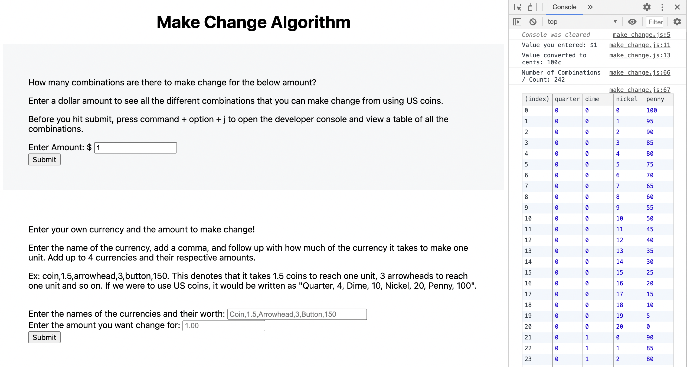

# Make Change Algorithm App

## An HTML, CSS, and JavaScript Application

Make Change uses JavaScript and jQuery to calculate all the combinations that US coins and user entered currencies can make change for a user entered amount. Users have access to two forms. The first form allows users to enter a positive dollar amount and shows all the combinations to reach that amount using US coins. The other form allows users to enter their own made up or real currencies, assign them an amount, enter a positive currency amount and shows all the combinations to reach that amount using their own currencies.

## Installation

- Clone down this repo and type "open index.html" in your terminal
- Press command + option + j to open developer console to view the combinations in a neat and efficient table format

## License

The app is available as open source under the terms of the [MIT License](https://opensource.org/licenses/MIT).
